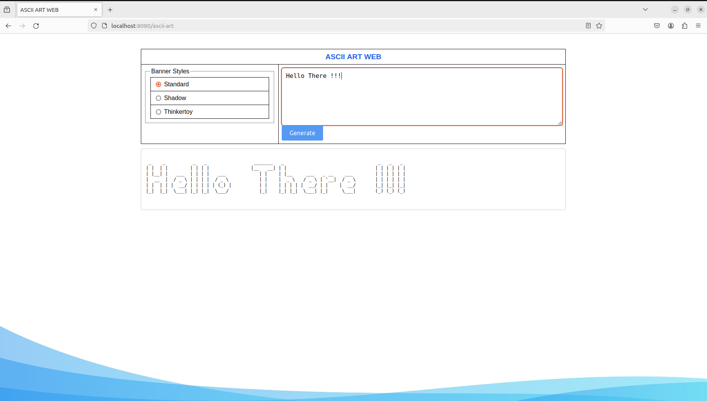

# ascii-art-web-stylize

## Description

`ascii-art-web-stylize` is a web server written in Go that allows users to convert text into ASCII art using various styles and banners. It provides a user-friendly web interface for inputting text, selecting a banner, and outputting the ASCII art representation.

### Key Features

- Supports multiple ASCII art banners for customization
- Handles HTTP requests and responses appropriately 
- Generates ASCII art based on user input and selected banner
- Displays the ASCII art output on the web page
- Follows good coding practices and project structure

## Usage

1. **Clone the repository**:

    ```bash
    git clone https://github.com/jowala/ascii-art-web-stylize.git
    ```

2. **Navigate to the project directory**:

    ```bash
    cd ascii-art-web-stylize
    ```

3. **Run the server**:

    ```bash
    go run main.go
    ```

4. **Open a web browser and visit** `http://localhost:8080`

5. **Enter text, select a banner, and click "Generate"**

6. **The ASCII art output will be displayed on the page**

## Examples
Output



## Implementation Details

The server uses the following key components:

- **HTTP handlers** for processing GET and POST requests
- **HTML templates** for rendering the web page
- **ASCII art generation logic** based on user input and selected banner
- **Appropriate HTTP status codes** for handling errors and success cases

### ASCII Art Generation Algorithm

1. Parsing the user input text
2. Selecting the appropriate ASCII art banner based on user choice
3. Iterating through each character in the input text
4. Mapping the character to its corresponding ASCII art representation in the selected banner
5. Assembling the ASCII art output by concatenating the character representations
6. Returning the generated ASCII art

## Authors

- [Joab Owala](https://github.com/jowala)
- [Ferdynand Odhiambo](https://github.com/MeFerdi)
