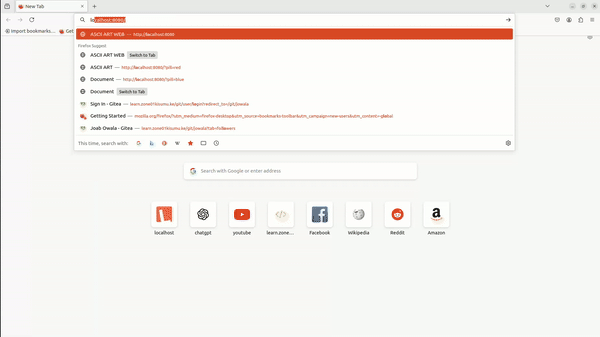

# Ascii-art-web

## Description
The ASCII Art Generator is a web application that allows users to generate ASCII art from their input text. Users can choose from different banner styles to customize the output.


## Usage
To run the ASCII Art Generator, follow these steps:

1. Make sure you have Go installed on your system. Use the link  below if not installed https://go.dev/doc/install

2. Clone the repository: 
```bash
  git clone https://github.com/ferdyodhiambo/ascii-art-web.git
```
3. Navigate to the project directory: 
  `cd ascii-art-web`
4. Run the application: 
```bash
go run main.go
```
5. Open your web browser and visit 
`http://localhost:8080`

## Implementation Details
The ASCII Art Generator uses the following algorithm to generate ASCII art:

1. The user enters text and selects a banner style in the web application.
2. The text and banner style are sent to the server using an HTTP POST request.
3. The server processes the request and generates the ASCII art using the `web/ascii` package.
4. The generated ASCII art is returned to the client as the response.
5. The client displays the ASCII art in the web application.


**NOTE:**

- The `web/ascii` package uses a predefined set of ASCII art characters to create the banner styles. 
- The algorithm iterates through each character in the input text and replaces it with the corresponding ASCII art characters based on the selected banner style.

- The server-side implementation is done using the Go standard library's `net/http` package for handling HTTP requests and responses. 
- The `html/template` package is used for rendering the HTML templates.

## Examples
Output


## Credits

- [Joab Owala](https://github.com/joabowala)
- [Ferdynand Odhiambo](https://github.com/MeFerdi)

## Acknowledgements

- Zone01 Kisumu